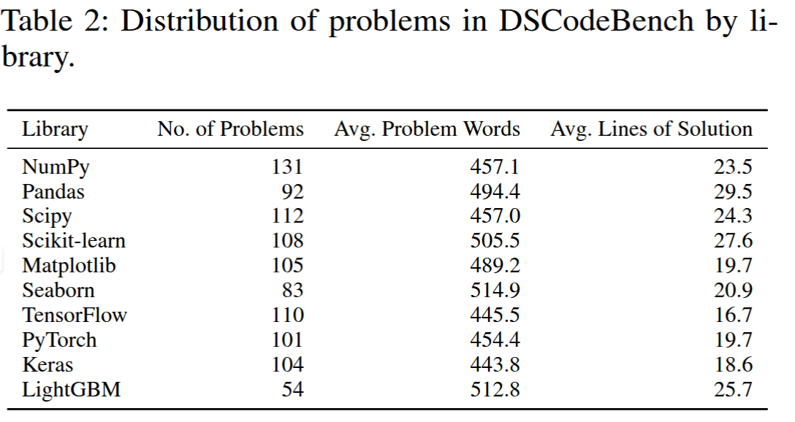
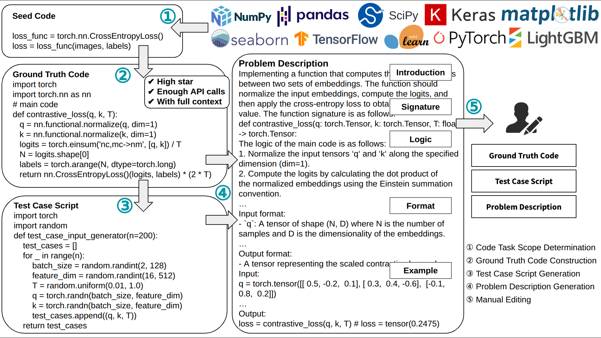
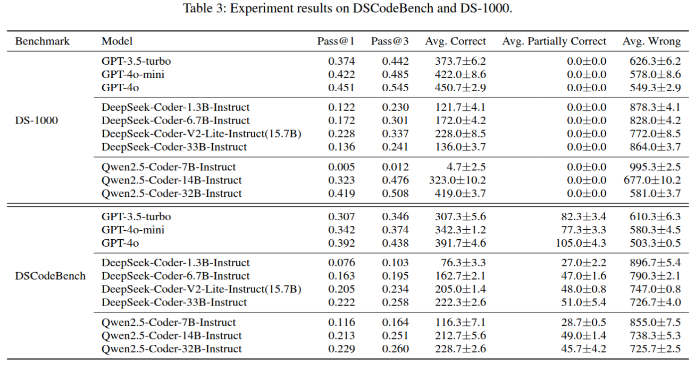

# DSCodeBench: A Realistic Benchmark for Data Science Code Generation

  

    

##  👋 Overview
**DSCodeBench** is a new benchmark designed to evaluate LLMs on complex and realistic data science code generation tasks. 
It comprises 1,000 meticulously crafted problems derived from real-world GitHub repositories, spanning ten widely-used Python data science libraries.

Compared to the state-of-the-art benchmark DS-1000, DSCodeBench offers a more challenging and representative evaluation suite, featuring:
- Longer and more realistic code solutions
- Broader library coverage
- Clearer and better-structured problem descriptions
- Stronger test suites

To build DSCodeBench, we developed a robust pipeline that includes task selection, ground truth code construction, test case generation, and problem description synthesis. This process is enhanced with a thorough manual review to ensure accuracy and improve evaluation reliability.

Experimental results demonstrate that DSCodeBench exhibits reliable scaling behavior: larger models consistently outperform smaller ones. For example, the best-performing model, GPT-4o, achieves a pass@1 score of 0.392, indicating there is still significant room for improvement in realistic data science code generation.

We hope DSCodeBench provides a rigorous and trustworthy foundation for advancing LLM-based data science programming.

## ⬇️ Benchmark

You can directly download the benchmark from `DS_bench.json`.
We also provide an extended version, `DS_bench_with_additional_logic.json`, which includes extra logic descriptions of the ground truth code in each problem description.

  

  

## 🚀 Benchmark Construction Pipeline & Evaluation

You can find the full code for benchmark construction and evaluation in the [`benchmark_construction_evaluation`](https://github.com/ShuyinOuyang/DS_bench/tree/main/benchmark_construction_evaluation) folder.
**A detailed README** is also provided in that directory for further guidance.

  

## 📍 Experimental Results

Results from our experiments are available in the  `experiment_results` folder.

  

